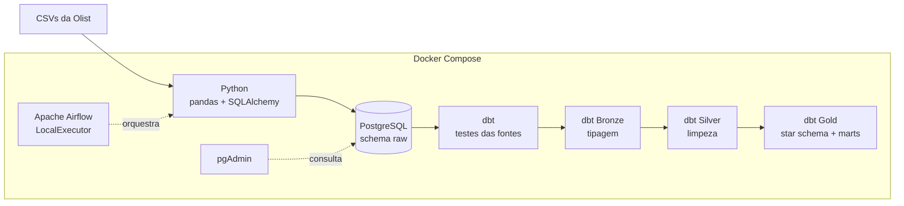
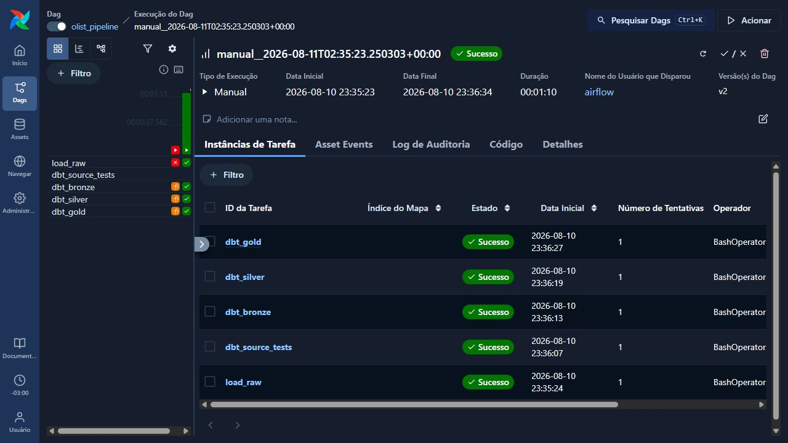
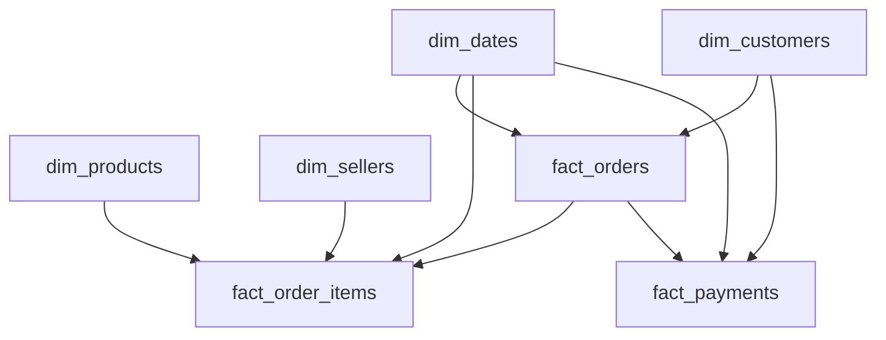

# Olist Data Pipeline

Pipeline de engenharia de dados end-to-end construída com o dataset público da Olist. O projeto combina Python, PostgreSQL, dbt, Docker e Apache Airflow para transformar arquivos CSV brutos em um modelo dimensional e métricas prontas para análise.

## Visão geral

O fluxo realiza ingestão, validação e transformação dos dados seguindo a arquitetura Medallion:

- **Raw:** cópia dos dados de origem no PostgreSQL.
- **Bronze:** correção de tipos e preparação técnica.
- **Silver:** limpeza, padronização e deduplicação.
- **Gold:** star schema e marts com métricas de negócio.

O Apache Airflow coordena todas as etapas em uma única DAG. Cada camada só é executada quando a anterior termina com sucesso.

## Arquitetura



Ordem das tasks no Airflow:

```text
load_raw → dbt_source_tests → dbt_bronze → dbt_silver → dbt_gold
```

## Execução no Airflow



A DAG usa `schedule=None` porque o dataset é histórico e estático. A execução é iniciada manualmente pela interface do Airflow, sem reprocessamentos automáticos desnecessários.

## Ferramentas

- **Apache Airflow 3:** orquestração, dependências, tentativas e logs das tasks.
- **Python 3.13:** leitura e carga dos CSVs com pandas e SQLAlchemy.
- **PostgreSQL 16:** armazenamento das camadas raw, bronze, silver e gold.
- **dbt Core:** transformações SQL, documentação e testes de qualidade.
- **Docker Compose:** ambiente local reproduzível com os serviços da pipeline.
- **pgAdmin:** inspeção e consultas no PostgreSQL.
- **Git e GitHub:** versionamento e publicação do projeto.

## Estrutura do projeto

```text
olist-pipeline/
├── airflow/
│   ├── dags/
│   │   └── olist_pipeline.py
│   ├── logs/
│   ├── plugins/
│   ├── Dockerfile
│   └── requirements.txt
├── data/
│   └── raw/                         # CSVs não versionados
├── dbt_olist/
│   ├── macros/
│   │   └── generate_schema_name.sql
│   ├── models/
│   │   ├── bronze/
│   │   ├── silver/
│   │   └── gold/
│   │       ├── dimensions/
│   │       ├── facts/
│   │       └── marts/
│   ├── dbt_project.yml
│   └── profiles.yml
├── docs/
│   └── images/
│       └── airflow-dag-success.png
├── pipeline/
│   ├── extract.py
│   └── load.py
├── .env.example
├── docker-compose.yml
├── README.md
└── requirements.txt
```

## Modelo dimensional

A camada gold contém quatro dimensões e três fatos:



### Dimensões

- `dim_dates`: calendário analítico compartilhado pelas fatos.
- `dim_customers`: dados cadastrais e geográficos dos clientes.
- `dim_products`: categorias e características físicas dos produtos.
- `dim_sellers`: dados cadastrais e geográficos dos vendedores.

### Fatos

- `fact_orders`: ciclo de vida dos pedidos e suas datas.
- `fact_order_items`: itens vendidos, preço, frete, produto e vendedor.
- `fact_payments`: pagamentos, parcelas, valores e tipo de pagamento.

### Marts

- `gold_monthly_revenue`: faturamento e volume de pedidos por mês.
- `gold_average_ticket`: ticket médio mensal.
- `gold_cancellation_rate`: taxa de cancelamento.
- `gold_category_revenue`: faturamento por categoria.
- `gold_payment_methods`: faturamento por método de pagamento.

## Qualidade dos dados

Na última validação completa, o projeto construiu **30 modelos** e executou **141 testes** sem erros:

- 21 testes nas fontes raw.
- 21 testes na bronze.
- 30 testes na silver.
- 69 testes na gold.

Os testes cobrem valores nulos, unicidade, chaves compostas e integridade dos relacionamentos entre fontes, dimensões e fatos.

## Como executar

### Pré-requisitos

- Docker Desktop com Docker Compose.
- Git.

### 1. Clonar o repositório

```bash
git clone https://github.com/LucasManhani/olist-pipeline.git
cd olist-pipeline
```

### 2. Criar o arquivo de ambiente

No PowerShell:

```powershell
Copy-Item .env.example .env
```

No Linux ou macOS:

```bash
cp .env.example .env
```

Edite o `.env`, defina as credenciais locais e substitua `AIRFLOW_JWT_SECRET` por uma chave aleatória com pelo menos 64 bytes. O mesmo valor é compartilhado pelo scheduler e pelo API Server do Airflow.

### 3. Adicionar o dataset

Baixe o dataset [Brazilian E-Commerce Public Dataset by Olist](https://www.kaggle.com/datasets/olistbr/brazilian-ecommerce) e coloque os arquivos CSV em:

```text
data/raw/
```

Os CSVs não são versionados no Git.

### 4. Construir e iniciar o ambiente

```bash
docker compose up --build -d
```

Confira os serviços:

```bash
docker compose ps
```

Os componentes do Airflow e os bancos devem aparecer como `healthy`.

### 5. Executar a pipeline

1. Acesse o Airflow em [http://localhost:8081](http://localhost:8081).
2. Localize e ative a DAG `olist_pipeline`.
3. Clique em **Acionar** para iniciar uma execução manual.
4. Acompanhe o estado e os logs de cada task pela interface.

O pgAdmin fica disponível em [http://localhost:8080](http://localhost:8080).

### Comandos úteis

Exibir o estado dos serviços:

```bash
docker compose ps
```

Acompanhar os logs do scheduler:

```bash
docker compose logs -f airflow-scheduler
```

Encerrar os serviços preservando os volumes:

```bash
docker compose down
```

## Decisões técnicas

- **ELT em vez de ETL:** os dados brutos são carregados antes das transformações realizadas no PostgreSQL pelo dbt.
- **Uma DAG com tasks separadas:** cada etapa possui logs e estado próprios, facilitando a identificação de falhas.
- **LocalExecutor:** adequado para execução local e para o escopo deste projeto de portfólio.
- **Testes raw antes das transformações:** falhas nas fontes interrompem a pipeline antes da bronze.
- **Star schema na gold:** dimensões reutilizáveis e fatos com granularidades distintas evitam duplicações nas métricas.
- **Sem constraints físicas no warehouse:** integridade validada pelos testes do dbt, mantendo as transformações portáveis.
- **Macro `generate_schema_name`:** gera os schemas `bronze`, `silver` e `gold` sem a concatenação padrão do dbt.
- **Execução manual:** apropriada para um dataset histórico que não recebe novos registros periodicamente.

## Dataset

O dataset público da Olist contém aproximadamente 100 mil pedidos realizados entre 2016 e 2018, com informações sobre clientes, produtos, vendedores, pagamentos, entregas e avaliações.

## Próximas evoluções possíveis

- Adicionar uma ferramenta de BI para consumir o star schema.
- Criar integração contínua para validar o dbt a cada alteração.
- Migrar armazenamento e orquestração para serviços gerenciados em nuvem.
