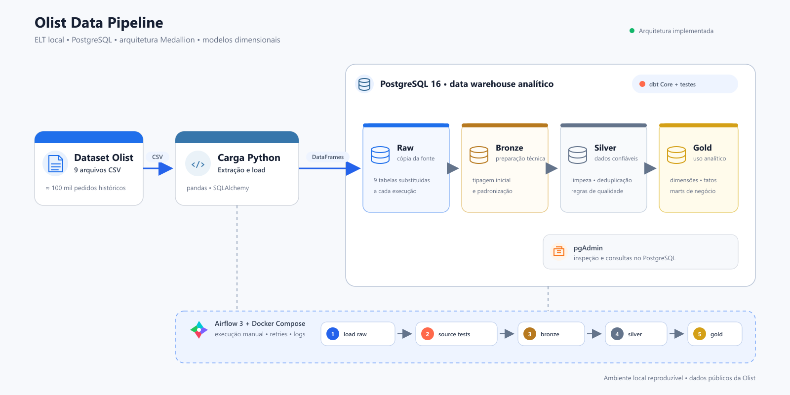
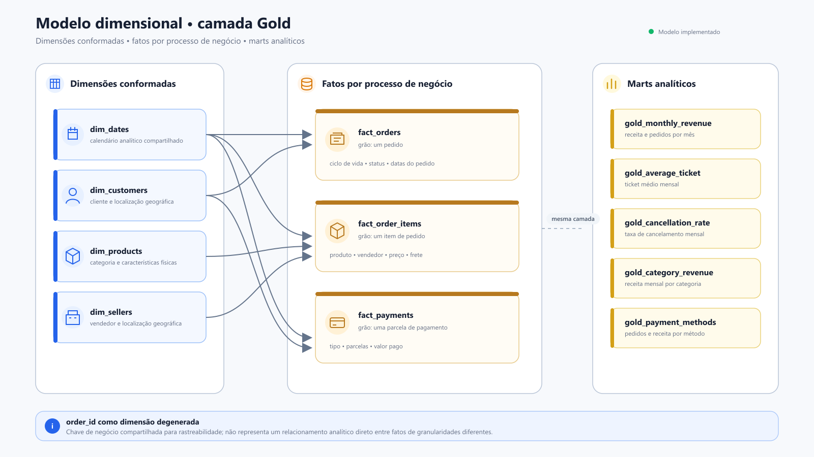
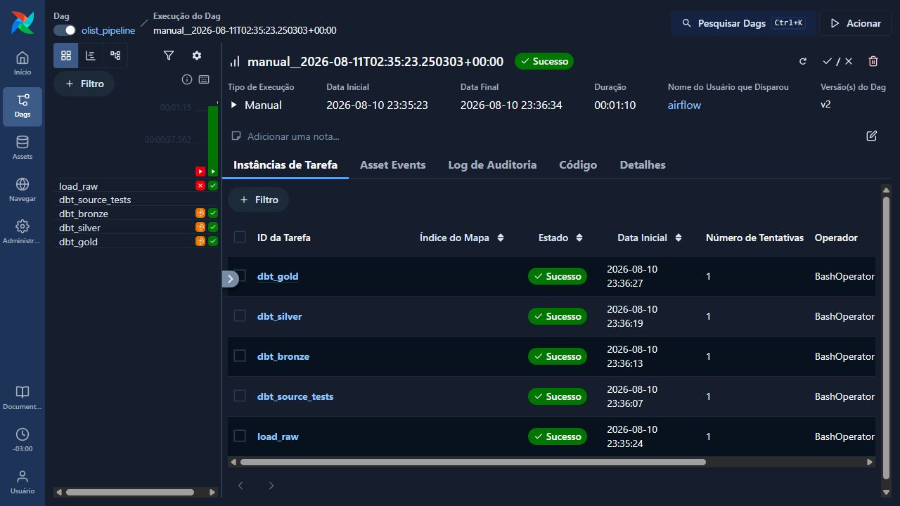

# Olist Data Pipeline

Pipeline ELT end-to-end que transforma o dataset público da Olist em modelos dimensionais e métricas de negócio utilizando Python, PostgreSQL, dbt, Docker e Apache Airflow.


## Visão geral

Este projeto de portfólio implementa uma pipeline local e reproduzível para ingestão, validação, transformação e modelagem analítica de aproximadamente 100 mil pedidos do e-commerce brasileiro Olist.

Os arquivos CSV são carregados no PostgreSQL e transformados pelo dbt seguindo a arquitetura Medallion. O resultado é uma camada gold composta por dimensões conformadas, fatos com granularidades distintas e marts voltados a perguntas de negócio.

O projeto combina:

- ingestão de múltiplos arquivos CSV com Python, pandas e SQLAlchemy;
- armazenamento das camadas raw, bronze, silver e gold no PostgreSQL;
- transformações ELT, documentação e testes com dbt;
- múltiplos star schemas com dimensões conformadas;
- orquestração local e manual com Airflow e Docker Compose;
- separação entre o banco analítico e o banco de metadados do Airflow;
- ambiente reproduzível e credenciais mantidas fora do versionamento.

## Arquitetura



O arquivo vetorial editável está disponível em [`docs/architecture/pipeline-architecture.svg`](docs/architecture/pipeline-architecture.svg).

### Fluxo dos dados

1. A carga Python lê os nove arquivos CSV disponíveis em `data/raw`.
2. Cada arquivo é convertido em um DataFrame e gravado no schema `raw` do PostgreSQL.
3. O dbt valida as fontes antes de iniciar as transformações.
4. A bronze realiza a preparação técnica e a tipagem inicial.
5. A silver limpa, padroniza e deduplica os dados.
6. A gold cria dimensões, fatos e marts analíticos.
7. O Airflow coordena as etapas e interrompe o fluxo caso uma validação falhe.

A ordem das tasks é:

```text
load_raw → dbt_source_tests → dbt_bronze → dbt_silver → dbt_gold
```

## Perguntas de negócio

Os modelos gold permitem responder:

- como evoluíram o faturamento e o volume de pedidos por mês?
- qual foi o ticket médio mensal?
- como variou a taxa de cancelamento?
- quais categorias geraram mais receita em cada período?
- quais métodos de pagamento concentraram mais pedidos e faturamento?

## Camadas de dados

| Camada | Tecnologia | Responsabilidade |
|---|---|---|
| Raw | Python + PostgreSQL | Preservar uma cópia relacional dos nove arquivos de origem. |
| Bronze | PostgreSQL + dbt | Corrigir tipos e realizar a preparação técnica inicial. |
| Silver | PostgreSQL + dbt | Limpar, padronizar e deduplicar entidades e eventos. |
| Gold | PostgreSQL + dbt | Expor dimensões, fatos e marts prontos para análise. |

A carga raw utiliza `if_exists="replace"`. Portanto, cada execução substitui as tabelas de origem antes que os modelos dbt sejam reconstruídos.

## Modelo dimensional



O arquivo vetorial editável está disponível em [`docs/architecture/dimensional-model.svg`](docs/architecture/dimensional-model.svg).

A camada gold contém quatro dimensões conformadas e três fatos. Cada fato representa um processo de negócio e funciona como o centro de seu próprio star schema.

### Dimensões

- `dim_dates`: calendário analítico compartilhado pelas fatos;
- `dim_customers`: dados cadastrais e geográficos dos clientes;
- `dim_products`: categorias e características físicas dos produtos;
- `dim_sellers`: dados cadastrais e geográficos dos vendedores.

### Fatos

- `fact_orders`: ciclo de vida e status dos pedidos;
- `fact_order_items`: itens vendidos, preço, frete, produto e vendedor;
- `fact_payments`: pagamentos, parcelas, valores e tipo de pagamento.

### Marts

- `gold_monthly_revenue`: faturamento e volume de pedidos por mês;
- `gold_average_ticket`: ticket médio mensal;
- `gold_cancellation_rate`: taxa de cancelamento mensal;
- `gold_category_revenue`: faturamento mensal por categoria;
- `gold_payment_methods`: pedidos e faturamento por método de pagamento.

O `order_id` aparece nas três fatos como uma **dimensão degenerada**. Ele oferece rastreabilidade entre processos, mas não representa um relacionamento analítico direto entre fatos com granularidades diferentes.

## Decisões de arquitetura

### ELT com transformações no PostgreSQL

Os dados brutos são carregados antes das transformações. As regras analíticas permanecem no dbt e são executadas dentro do PostgreSQL, separando a ingestão Python da lógica de modelagem.

### Airflow local com LocalExecutor

O Airflow é executado em Docker Compose com `LocalExecutor`. Uma única DAG possui tasks independentes para carga, testes das fontes e construção de cada camada, oferecendo estado, tentativas e logs separados.

A execução é manual porque o dataset é histórico e estático. Um agendamento recorrente criaria reprocessamentos sem a chegada de novos dados.

### Bancos separados

O ambiente utiliza uma instância PostgreSQL para os dados analíticos e outra para os metadados do Airflow. Essa separação evita misturar o estado operacional do orquestrador com os dados do projeto.

### Validação antes das transformações

Os testes das fontes raw são executados antes da bronze. Uma falha de qualidade interrompe a DAG antes que o problema seja propagado para as camadas seguintes.

### Múltiplos star schemas

Cada fato mantém sua própria granularidade e reutiliza dimensões conformadas. A modelagem evita joins diretos entre fatos, reduzindo o risco de duplicações e métricas incorretas.

### Integridade gerenciada pelo dbt

O warehouse não depende de constraints físicas entre todas as tabelas analíticas. Unicidade, valores obrigatórios, chaves compostas e relacionamentos são validados pelos testes do dbt.

### Schemas previsíveis

A macro `generate_schema_name` remove a concatenação padrão do dbt e mantém os schemas finais com os nomes `bronze`, `silver` e `gold`.

## Qualidade dos dados

Na última validação completa, o projeto construiu **30 modelos** e executou **141 testes** sem erros:

- 21 testes nas fontes raw;
- 21 testes na bronze;
- 30 testes na silver;
- 69 testes na gold.

Os testes cobrem:

- valores nulos;
- unicidade de chaves;
- chaves compostas;
- valores aceitos;
- integridade dos relacionamentos entre fontes, dimensões e fatos.

## Estrutura do repositório

```text
.
├── airflow/
│   ├── dags/
│   │   └── olist_pipeline.py
│   ├── logs/
│   ├── plugins/
│   ├── Dockerfile
│   └── requirements.txt
├── data/
│   └── raw/                         # CSVs não versionados
├── dbt_olist/
│   ├── macros/
│   │   └── generate_schema_name.sql
│   ├── models/
│   │   ├── bronze/
│   │   ├── silver/
│   │   └── gold/
│   │       ├── dimensions/
│   │       ├── facts/
│   │       └── marts/
│   ├── dbt_project.yml
│   └── profiles.yml
├── docs/
│   ├── architecture/
│   │   ├── dimensional-model.svg
│   │   └── pipeline-architecture.svg
│   └── images/
│       ├── airflow-dag-success.png
│       ├── dimensional-model.png
│       └── pipeline-architecture.png
├── pipeline/
│   ├── extract.py
│   └── load.py
├── .env.example
├── docker-compose.yml
├── README.md
└── requirements.txt
```

## Pré-requisitos

- Git;
- Docker Desktop com Docker Compose;
- dataset público da Olist.

Python, PostgreSQL, dbt e Airflow não precisam ser instalados diretamente no computador para a execução principal.

## Configuração local

Clone o repositório e entre na pasta:

```powershell
git clone https://github.com/LucasManhani/olist-pipeline.git
Set-Location "olist-pipeline"
```

Crie o arquivo de ambiente:

```powershell
Copy-Item .env.example .env
```

Preencha as credenciais locais no `.env` e substitua `AIRFLOW_JWT_SECRET` por uma chave aleatória com pelo menos 64 bytes. O mesmo segredo é compartilhado pelos componentes do Airflow.

Exemplo de variáveis:

```dotenv
DB_HOST=localhost
DB_PORT=5432
DB_NAME=olist
DB_USER=postgres
DB_PASSWORD=sua_senha

PGADMIN_EMAIL=seu_email@example.com
PGADMIN_PASSWORD=sua_senha

AIRFLOW_DB_PASSWORD=sua_senha_do_banco_airflow
AIRFLOW_JWT_SECRET=sua_chave_aleatoria
```

O `.env`, os CSVs, os logs e os artefatos locais não são versionados.

## Dataset

Baixe o [Brazilian E-Commerce Public Dataset by Olist](https://www.kaggle.com/datasets/olistbr/brazilian-ecommerce) e coloque os arquivos CSV em:

```text
data/raw/
```

O conjunto contém aproximadamente 100 mil pedidos realizados entre 2016 e 2018, com dados de clientes, produtos, vendedores, pagamentos, entregas e avaliações.

## Execução com Airflow

Construa e inicie o ambiente:

```powershell
docker compose up --build -d
docker compose ps
```

Os bancos e os componentes do Airflow devem aparecer como `healthy` ou em execução.

Acesse:

- Airflow: [http://localhost:8081](http://localhost:8081);
- pgAdmin: [http://localhost:8080](http://localhost:8080).

Na interface do Airflow, ative a DAG `olist_pipeline` e dispare uma execução manual. Cada task pode realizar uma nova tentativa, com intervalo de um minuto, depois de uma falha.

Para acompanhar os logs do scheduler:

```powershell
docker compose logs -f airflow-scheduler
```

Para encerrar o ambiente preservando os volumes:

```powershell
docker compose down
```

Os volumes nomeados preservam o warehouse e o banco de metadados do Airflow para a próxima inicialização.

## Evidência de execução

### DAG executada com sucesso



## Ambiente local e segurança

- Todo o ambiente é executado localmente, sem recursos de nuvem continuamente ativos.
- As credenciais são fornecidas por variáveis de ambiente e permanecem fora do Git.
- Os CSVs de origem não são versionados.
- PostgreSQL e pgAdmin ficam expostos apenas nas portas configuradas pelo Docker Compose.
- Os dados analíticos e os metadados do Airflow utilizam volumes separados.
- O ambiente foi desenhado para estudo e demonstração, não para exposição pública.

## Problemas encontrados e aprendizados

Durante o desenvolvimento, algumas decisões consolidaram conceitos importantes:

- prefixos de CEP precisam ser lidos como texto para preservar zeros à esquerda;
- fatos de granularidades diferentes não devem ser combinadas diretamente;
- testar as fontes antes das transformações impede a propagação de dados inválidos;
- schemas personalizados do dbt exigem controle explícito da nomenclatura;
- componentes do Airflow 3 precisam compartilhar corretamente a configuração e o segredo JWT;
- separar o banco operacional do Airflow do warehouse simplifica a manutenção e a análise.

## Limitações atuais

- dataset histórico e estático;
- carga raw completa em vez de incremental;
- DAG acionada manualmente;
- execução restrita ao ambiente local;
- ausência de dashboard ou integração com ferramenta de BI;
- ausência de CI/CD e testes unitários para a ingestão Python.

## Possíveis evoluções

- adicionar uma ferramenta de BI para consumir os star schemas;
- criar testes unitários para extração e carga;
- adicionar integração contínua para validar Python e dbt;
- gerar e publicar a documentação do dbt;
- incluir observabilidade adicional para duração e falhas das tasks;
- avaliar serviços gerenciados em nuvem caso o dataset passe a receber atualizações.
